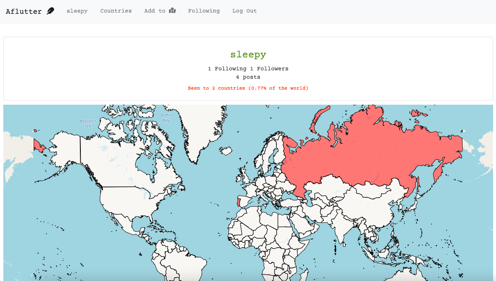

# Aflutter

## Table of Contents
* [Description](#description)
* [Installation](#installation)
* [Screenshots](#screenshots)
* [File Tree](#file-tree)

## Description
Aflutter is a web app that allows users to track, map, and blurb about the countries they have been to. 

**Features include:**
- Without logging in:
    - Standard log in and registration pages
    - Homepage that shows “flutters,” which are travel blurbs limited to 195 characters  
    - Countries page that lists all countries, each linking to their respective page
    - Country-specific page that lists flutters pertaining to that country
- If logged in:
    - Profile page that shows a user’s stats, a map of the countries they have been to, and the user's flutters. Allows other users to follow or unfollow the user.
    - An added "post flutters" form on the homepage that allows user to post a flutter to a country. Allows users to like or unlike a specific post.
    - Add Countries to Map page that allows the user to see and add countries that they have visited. Contains a blank world map.
    - Following page that shows flutters by those followed by the user

This project is designed and implemented using Python, Django, JavaScript, HTML, CSS and Bootstrap.

## Installation
- Install the latest versions of Python and Django 
- Install folium, a Python library that creates dynamic maps, via `pip install folium`

## Screenshots

## File Tree
- `world` - Web app for tracking, visualizing, and blurbing about the countries you have visited
    - `static\json` 
        - `countries.json` -  JSON file that contains country info such as country name and geographic data (available [here](https://github.com/samayo/country-json))
    - `static\world` 
        - `world.css` - Styles for all HTML files
        - `world.js` - JavaScript file which includes functions to update, like and unlike a post
    - `templates\world` - Holds all HTML files
        - `add_countries.html` - Add and view a list of countries visited
        - `blank_map.html` - A blank but interactive map to be included in `add_countries.html`
        - `countries.html` - All countries listed in alphabetic order
        - `country.html` - Flutters pertaining to a specific country, from the most to least liked
        - `following.html` - Flutters posted by those followed by the user
        - `login.html` - Login page
        - `my_map_{user_id}.html` - Interactive maps highlighting countries visited by a specific user
        - `profile.html` - A specific user's stats (e.g., number of followers, percentage of world visited, etc.), `my_map_{user_id}.html`, and the user's flutters
        - `register.html` - Registration page
    - `models.py` - Contains 3 models: Country, User, and Post
    - `urls.py` - Contains all url paths for the app
    - `views.py` - Contains all view functions for app
